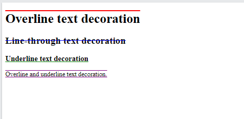
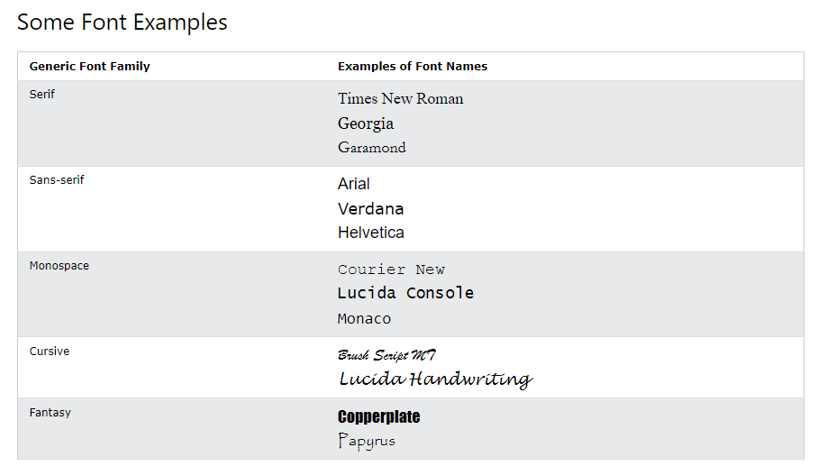

# CSS

CSS is the language we use to style an HTML document.<br>
CSS describes how HTML elements should be displayed.<br>
CSS stands for Cascading Style Sheets.

## using CSS in individual tag

html file.

```
<h1>Why Use CSS</h1>
<h1>country</h1>
<p>Man is mortal</p>
<p>Bangladesh</p>
```

CSS file.

```
p{
 color: white;
  text-align: center;   
}
h1{
 color: white;
  text-align: center;   
}
```

## using CSS in class

format

```
.class_name{
    ----
    ----
}
```

html file.

```
    <h1 class="demo">Why Use CSS</h1>
    <h1 class="demo">country</h1>
    <p class="demo">Man is mortal</p>
    <p class="demo">Bangladesh</p>  
```

CSS file.

```
.demo{
    color: red;
     text-align: center;   
 }
```

# Three Ways to Insert CSSThree Ways to Insert CSS

1. External CSS
2. Internal CSS
3. Inline CSS

## External CSS

html file.

```
    <h1 class="demo">Why Use CSS</h1>
    <h1 class="demo">country</h1>
    <p class="demo">Man is mortal</p>
    <p class="demo">Bangladesh</p>  
```

CSS file.

```
.demo{
    color: red;
     text-align: center;   
 }
```

## internal CSS

html file.

```
<!DOCTYPE html>
<html lang="en">

<head>
    <title>Document</title>
    <style>
        .demo {
            color: green;
            text-align: center;
        }
    </style>

</head>

<body>

    <h1 class="demo">Why Use CSS</h1>
    <h1 class="demo">country</h1>
    <p class="demo">Man is mortal</p>
    <p class="demo">Bangladesh</p>

</body>

</html>
```

## Inline CSS

```
<body>
  <h1 style="color:blue;text-align:center;">This is a heading</h1>
   <p style="color:red;">This is a paragraph.</p>

</body>
```

# CSS color

Colors are specified using predefined color names, or RGB, HEX, HSL, RGBA, HSLA values.

## CSS Background Color

we can set the background color for HTML elements. here color

```
<h1 style="background-color:Orange;">Orange</h1>
```

<br>

## CSS Text Color

we can set the color of text.

```
<h1 style="color:Orange;">Hello World</h1>
```

<br>

## CSS Border Color

We can set the color of borders.

```
<h1 style="border: 2px solid Red;">Hello World</h1>
```

<br>

## CSS Color Values

In CSS, colors can also be specified using RGB values, HEX values, HSL values, RGBA values, and HSLA values.<br>
Same as color name "Tomato":

1. rgb(255, 99, 71)
2. #ff6347
3. hsl(9, 100%, 64%)

```
<h1 style="background-color:rgb(255, 99, 71);">rgb(255, 99, 71)</h1>
<h1 style="background-color:#ff6347;">#ff6347</h1>
<h1 style="background-color:hsl(9, 100%, 64%);">hsl(9, 100%, 64%)</h1>
```

<br>
Same as color name "Tomato", but 50% transparent(স্বচ্ছ).<br>

```
<h1 style="background-color:rgba(255, 99, 71, 0.5);">rgba(255, 99, 71, 0.5)</h1>
<h1 style="background-color:hsla(9, 100%, 64%, 0.5);">hsla(9, 100%, 64%, 0.5)</h1>
```

<br>

## CSS RGB Colors

An RGB color value represents RED, GREEN, and BLUE light sources.<br>
RGB value.
In CSS, a color can be specified as an RGB value, using this formula.<br>
rgb(red, green, blue)<br>
Each parameter (red, green, and blue) defines the intensity of the color between 0 and 255.<br>
For example, rgb(255, 0, 0) is displayed as red, because red is set to its highest value (255) and the others are set to 0.<br>

```
<h2 style="background-color:rgb(255, 0, 0);">rgb(255, 0, 0)</h2>
```

<br>

Example.

```
<h2 style="background-color:rgb(255, 0, 0);">rgb(255, 0, 0)</h2>

<h2 style="background-color:rgb(0, 0, 255);">rgb(0, 0, 255)</h2>

<h2 style="background-color:rgb(60, 179, 113);">rgb(60, 179, 113)</h2>

<h2 style="background-color:rgb(238, 130, 238);">rgb(238, 130, 238)</h2>

<h2 style="background-color:rgb(255, 165, 0);">rgb(255, 165, 0)</h2>

<h2 style="background-color:rgb(106, 90, 205);">rgb(106, 90, 205)</h2>
```

Output.
<br>

Shades of gray are often defined using equal values for all the 3 light sources.<br>

```
<h2 style="background-color:rgb(60, 60, 60);">rgb(60, 60, 60)</h2>

<h2 style="background-color:rgb(90, 90, 90);">rgb(90, 90, 90)</h2>

<h2 style="background-color:rgb(120, 120, 120);">rgb(120, 120, 120)</h2>

<h2 style="background-color:rgb(180, 180, 180);">rgb(180, 180, 180)</h2>

<h2 style="background-color:rgb(210, 210, 210);">rgb(210, 210, 210)</h2>

<h2 style="background-color:rgb(240, 240, 240);">rgb(240, 240, 240)</h2>
```

Output:
<br>

### RGBA Value

RGBA color values are an extension of RGB color values with an alpha channel - which specifies the opacity for a color.<br>
An RGBA color value is specified with:<br>
<b>rgba(red, green, blue, alpha)</b><br>
The alpha parameter is a number between 0.0 (fully transparent) and 1.0 (not transparent at all):<br>
Example:

```
<h2 style="background-color:rgba(255, 99, 71, 0);">rgba(255, 99, 71, 0)</h2>

<h2 style="background-color:rgba(255, 99, 71, 0.2);">rgba(255, 99, 71, 0.2)</h2>

<h2 style="background-color:rgba(255, 99, 71, 0.4);">rgba(255, 99, 71, 0.4)</h2>

<h2 style="background-color:rgba(255, 99, 71, 0.6);">rgba(255, 99, 71, 0.6)</h2>

<h2 style="background-color:rgba(255, 99, 71, 0.8);">rgba(255, 99, 71, 0.8)</h2>

<h2 style="background-color:rgba(255, 99, 71, 1);">rgba(255, 99, 71, 1)</h2>
```

Ouput:
<br>

## CSS HEX Colors

A hexadecimal color is specified with: #RRGGBB, where the RR (red), GG (green) and BB (blue) hexadecimal integers specify the components of the color.<br>
In CSS, a color can be specified using a hexadecimal value in the form:<br>

<b>#rrggbb</b><br>
Where rr (red), gg (green) and bb (blue) are hexadecimal values between 00 and ff (same as decimal 0-255).<br>
For example, #ff0000 is displayed as red, because red is set to its highest value (ff) and the others are set to the lowest value (00).<br>
To display black, set all values to 00, like this: #000000.<br>

To display white, set all values to ff, like this: #ffffff.  <br>
Example:

```
<h2 style="background-color:#000000;">#000000</h2>

<h2 style="background-color:#ffffff;">#ffffff</h2>

<h2 style="background-color:#ff0000;">#ff0000</h2>

<h2 style="background-color:#0000ff;">#0000ff</h2>

<h2 style="background-color:#3cb371;">#3cb371</h2>

<h2 style="background-color:#ee82ee;">#ee82ee</h2>

<h2 style="background-color:#ffa500;">#ffa500</h2>
```

Output:
<br>

Shades of gray are often defined using equal values for all the 3 light sources.

```
<h2 style="background-color:#3c3c3c;">#3c3c3c</h2>

<h2 style="background-color:#616161;">#616161</h2>

<h2 style="background-color:#787878;">#787878</h2>

<h2 style="background-color:#b4b4b4;">#b4b4b4</h2>

<h2 style="background-color:#f0f0f0;">#f0f0f0</h2>

<h2 style="background-color:#f9f9f9;">#f9f9f9</h2>
```

Output:
<br>

### 3 Digit HEX Value

Sometimes you will see a 3-digit hex code in the CSS source.

<b>#rgb</b>
Where r, g, and b represent the red, green, and blue components with val/ues between 0 and f.<br>
The 3-digit hex code can only be used when both the values (RR, GG, and BB) are the same for each component. So, if we have #ff00cc, it can be written like this: #f0c.<br>
Here is an example.<br>

```
  background-color: #fc9; /* same as #ffcc99 */
  color: #f0f; /* same as #ff00ff */
  color: #b58; /* same as #bb5588 */
```

# CSS Backgrounds

The CSS background properties are used to add background effects for elements.<br>
In these chapters, you will learn about the following CSS background properties:<br>

1. background-color
2. background-image
3. background-repeat
4. background-attachment
5. background-position
6. background (shorthand property).

## CSS background-color

The background-color property specifies the background color of an element.<br>
method of background-color.

1. a valid color name - like "red"
2. a HEX value - like "#ff0000"
3. an RGB value - like "rgb(255,0,0)"

```
 <p style="background-color: green">hello world</p> 
 <p style="background-color: #ffddaa">hello world</p>
  <p style="background-color: rgba(255,20,30)">hello world</p>
```

<br>

## Opacity / Transparency

The opacity property specifies the opacity/transparency of an element. It can take a value from 0.0 - 1.0. The lower value, the more transparent:<br>

HTML code.

```
<div class="first">
  <h1>opacity 0.1</h1>
</div>

<div class="second">
  <h1>opacity 0.3</h1>
</div>

<div class="third">
  <h1>opacity 0.6</h1>
</div>

<div>
  <h1>opacity 1 (default)</h1>
</div>
```

CSS code.

```
div {
  background-color: green;
}

div.first {
  opacity: 0.1;
}

div.second {
  opacity: 0.3;
}

div.third {
  opacity: 0.6;
}
```

## CSS Background Image

The background-image property specifies an image to use as the background of an element.<br>
<b>method of page backgroud</b><br>

```
body {
  background-image: url("image.png");
}
</style>
<body>

<h1>Hello World!</h1>

<p>This page has an image as the background!</p>

</body>
```

<b>The background image can also be set for specific elements, like the <p> element.</b>

```
<style>
p {
  background-image: url("paper.gif");
}
</style>
<body>

<p>This paragraph has an image as the background!</p>

</body>
```

## CSS Background Image Repeat

CSS background-repeat<br>

```
body {
  background-image: url("img_tree.png");
  background-repeat: repeat;
}
```

<br>

CSS background-no-repeat<br>

```
body {
  background-image: url("img_tree.png");
  background-repeat: no-repeat;
}
```

<br>

## CSS background-position

The background-position property is used to specify the position of the background image.
<br>
Example.<br>
Position the background image in the top-right corner: <br>

```
body {
  background-image: url("img_tree.png");
  background-repeat: no-repeat;
  background-position: right top;
  margin-right: 200px;
}
```


<br>

## CSS Background Attachment

The background-attachment property specifies whether the background image should scroll or be fixed (will not scroll with the rest of the page):<br>

Example.<br>
Specify that the background image should be fixed:<br>

```
body {
  background-image: url("img_tree.png");
  background-repeat: no-repeat;
  background-position: right top;
  margin-right: 200px;
  background-attachment: fixed;
}
```

Specify that the background image should scroll with the rest of the page:<br>

```
body {
  background-image: url("img_tree.png");
  background-repeat: no-repeat;
  background-position: right top;
  margin-right: 200px;
  background-attachment: scroll;
}
```

# CSS Borders

The CSS border properties allow you to specify the style, width, and color of an element's border.<br>

Example.

```
<!DOCTYPE html>
<html>
<head>
<style>
p.dotted {
  border-style: dotted;}
p.dashed {border-style: dashed;}
p.solid {border-style: solid;}
p.double {border-style: double;}
p.groove {border-style: groove;}
p.ridge {border-style: ridge;}
p.inset {border-style: inset;}
p.outset {border-style: outset;}
p.none {border-style: none;}
p.hidden {border-style: hidden;}
p.mix {border-style: dotted dashed solid double;}
</style>
</head>
<body>

<h2>The border-style Property</h2>
<p>This property specifies what kind of border to display:</p>

<p class="dotted">A dotted border.</p>
<p class="dashed">A dashed border.</p>
<p class="solid">A solid border.</p>
<p class="double">A double border.</p>
<p class="groove">A groove border.</p>
<p class="ridge">A ridge border.</p>
<p class="inset">An inset border.</p>
<p class="outset">An outset border.</p>
<p class="none">No border.</p>
<p class="hidden">A hidden border.</p>
<p class="mix">A mixed border.</p>

</body>
</html>
```

Ouput:
<br>

Border color: <br>

```
p{
  border-style: solid;
  border-color: red;
}
```

# CSS Margins

Margins are used to create space around elements, outside of any defined borders.<br>
Example.<br>

```
<!DOCTYPE html>
<html>
<head>
<style>
div {
  margin: 200px;
  border: 1px solid #4CAF50;
}
</style>
</head>
<body>

<h2>CSS Margins</h2>
<div>This element has a margin of 70px.</div>
<p>CSS Margins </p>
</body>
</html>
```

Output:<br>
<br>

Margin - Individual Sides<br>

```
p {
  margin-top: 100px;
  margin-bottom: 100px;
  margin-right: 150px;
  margin-left: 80px;
}
```

Margin - Shorthand Property.<br>
margin: 25px 50px 75px 100px;
<ul>
<li>top margin is 25px</li>
<li>right margin is 50px</li>
<li>bottom margin is 75px</li>
<li>left margin is 100px</li>
</ul><br>
margin: 25px 50px 75px;
<ul>
<li>top margin is 25px</li>
<li>right margin is 50px</li>
<li>bottom margin is 75px</li>
</ul><br>
margin: 25px 50px;
<ul>
<li>top margin is 25px</li>
<li>right margin is 50px</li>
</ul><br>
margin: 25px;
<ul>
<li>all four margins are 25px</li>
</ul>

<b>The auto Value.</b><br>
You can set the margin property to auto to horizontally center the element within its container.

The element will then take up the specified width, and the remaining space will be split equally between the left and right margins.<br>

```
div {
  width: 300px;
  margin: auto;
  border: 1px solid red;
}
```

# CSS Padding

Padding is used to create space around an element's content, inside of any defined borders.<br>

```
div {
  padding: 100px;
  border: 1px solid #4CAF50;
}
```


## Padding - Individual Sides

CSS has properties for specifying the padding for each side of an element:<br>
<li>padding-top</li>
<li>padding-right</li>
<li>padding-bottom</li>
<li>padding-left</li>

```
div {
  padding-top: 50px;
  padding-right: 30px;
  padding-bottom: 50px;
  padding-left: 80px;
}
```

Padding - Shorthand Property.
It is the same as the margin.<br>

width,height:<br>

```
<!DOCTYPE html>
<html>
<head>
<style>
div.ex1 {
  width: 300px;
   height: 100px;
  background-color: yellow;
}

div.ex2 {
  width: 300px;
  height: 200px;
  padding: 25px;
  background-color: pink;
}
</style>
</head>
<body>

<h2>Padding and element width</h2>

<div class="ex1">This div is 300px wide.</div>
<br>

<div class="ex2">hello world.</div>

</body>
</html>
```

Output:<br>
<br>

# The CSS Box Model

```
 border: 15px solid green;
 // here 15px is width of border.
```

# CSS Outline

```
<!DOCTYPE html>
<html>
<head>
<style>
p {
  border: 2px solid black;
  outline: #4CAF50 solid 10px;
  margin: auto;  
  padding: 20px;
  text-align: center;
}
</style>
</head>
<body>

<h2>CSS Outline</h2>
<p>This element has a 2px black border and a green outline with a width of 10px.</p>

</body>
</html>
```

output:<br>
<br>
An outline is a line drawn outside the element's border.<br>
CSS has the following outline properties:

<li>outline-style</li>
<li>outline-color</li>
<lioutline-width></li>
<li>outline-offset</li>
<li>outline</li>

# CSS text

## text color

```
<p style="color:red">hello world</p>
```

## CSS Text Alignment

In this chapter you will learn about the following properties:

<li>text-align</li>
<li>text-align-las</li>t
<li>direction</li>
<li>unicode-bidi</li>
<li>vertical-align</li>

```
  text-align: center;// text position in center
  text-align: left;// text position in center
  text-align: right;// text position in center
```

 <b>text-align: justify </b> mean that every line same width.<br>

## CSS Text Decoration

In this chapter you will learn about the following properties:

1. text-decoration-line
2. text-decoration-color
3. text-decoration-style
4. text-decoration-thickness
5. text-decoration

```
<!DOCTYPE html>
<html>
<head>
<style>
h1 {
  text-decoration-line: overline;
  text-decoration-color: red;
}

h2 {
  text-decoration-line: line-through;
  text-decoration-color: blue;
}

h3 {
  text-decoration-line: underline;
  text-decoration-color: green;  
}

p {
  text-decoration-line: overline underline;
  text-decoration-color: purple;  
}
</style>
</head>
<body>

<h1>Overline text decoration</h1>
<h2>Line-through text decoration</h2>
<h3>Underline text decoration</h3>
<p>Overline and underline text decoration.</p>

</body>
</html>

```

<br>

Specify a Style for the Decoration Line.<br>

```


<!DOCTYPE html>
<html>
<head>
<style>
h1 {
  text-decoration-line: underline;
  text-decoration-style: solid; /* this is default */
}

h2 {
  text-decoration-line: underline;
  text-decoration-style: double;
}

h3 {
  text-decoration-line: underline;
  text-decoration-style: dotted;  
}

p.ex1 {
  text-decoration-line: underline;
  text-decoration-style: dashed;  
}

p.ex2 {
  text-decoration-line: underline;
  text-decoration-style: wavy;  
}

p.ex3 {
  text-decoration-line: underline;
  text-decoration-color: red;  
  text-decoration-style: wavy;  
}
</style>
</head>
<body>

<h1>Heading 1</h1>
<h2>Heading 2</h2>
<h3>Heading 3</h3>
<p class="ex1">A paragraph.</p>
<p class="ex2">Another paragraph.</p>
<p class="ex3">Another paragraph.</p>

</body>
</html>
```

<br>

## CSS Text Transformation

<b>Text Transformation</b><br>
The text-transform property is used to specify uppercase and lowercase letters in a text.

```
p.uppercase {
  text-transform: uppercase;
}

p.lowercase {
  text-transform: lowercase;
}

p.capitalize {
  text-transform: capitalize;
}

<p class="uppercase">This text is transformed to uppercase.</p>

<p class="lowercase">This text is transformed to lowercase.</p>

<p class="capitalize">This text is capitalized.</p>
```

## CSS Text Spacing

In this chapter you will learn about the following properties:<br>

1. text-indent
2. letter-spacing
3. line-height
4. word-spacing
5. white-space

<b>Letter space.</b>

```
h2 {
  letter-spacing: 5px;
}

h3 {
  letter-spacing: -2px;
}
```

<b>Line Height.</b>

```
p.small {
  line-height: 0.8;
}

p.big {
  line-height: 1.8;
}
```

<b>Word Spacing.</b>

```
p.one {
  word-spacing: 10px;
}

p.two {
  word-spacing: -2px;
}
```

## CSS Text Shadow

```
h1 {
  text-shadow: 2px 2px;
}
```

<br>

# CSS Fonts

In CSS there are five generic font families:<br>

1. <b>Serif</b> fonts have a small stroke at the edges of each letter. They create a sense of formality and elegance.
2. <b>Sans-serif</b> fonts have clean lines (no small strokes attached). They create a modern and minimalistic look.
3. <b>Monospace</b> fonts - here all the letters have the same fixed width. They create a mechanical look.
4. <b>Cursive</b> fonts imitate human handwriting.
5. <b>Fantasy</b> fonts are decorative/playful fonts.

<br>
<br>

```
.p1 {
  font-family: "Times New Roman", Times, serif;
}

.p2 {
  font-family: Arial, Helvetica, sans-serif;
}

.p3 {
  font-family: "Lucida Console", "Courier New", monospace;
}


<h1>CSS font-family</h1>
<p class="p1">This is a paragraph, shown in the Times New Roman font.</p>
<p class="p2">This is a paragraph, shown in the Arial font.</p>
<p class="p3">This is a paragraph, shown in the Lucida Console font.</p>
```

Output.<br>
<br>

## CSS Web Safe Fonts

CSS Web Safe Fonts.<br>
Best Web Safe Fonts for HTML and CSS
The following list are the best web safe fonts for HTML and CSS:

<li>Arial (sans-serif)</li>
<li>Verdana (sans-serif)</li>
<li>Tahoma (sans-serif)</li>
<li>Trebuchet MS (sans-serif)</li>
<li>Times New Roman (serif)</li>
<li>Georgia (serif)</li>
<li>Garamond (serif)</li>
<li>Courier New (monospace)</li>
<li>Brush Script MT (cursive)</li>

<br>
<br>
<br>
<br>

## CSS Font Style

The font-style property is mostly used to specify italic text.<br>

This property has three values:<br>

<li>normal - The text is shown normally.</li>
<li>italic - The text is shown in italics.</li>
<li>oblique - The text is "leaning" (oblique is very similar to italic, but less supported)</li>

Example:<br>

```
p.normal {
  font-style: normal;
}

p.italic {
  font-style: italic;
}

p.oblique {
  font-style: oblique;
}
```

<b>Font Weight.</b><br>
The font-weight property specifies the weight of a font:<br>

```
p.normal {
  font-weight: normal;
}

p.thick {
  font-weight: bold;
}
```

<b>Font Variant</b>
The font-variant property specifies whether or not a text should be displayed in a small-caps font.<br>
```
p.normal {
  font-variant: normal;
}

p.small {
  font-variant: small-caps;
}

<h1>The font-variant property</h1>

<p class="normal">My name is Hege Refsnes.</p>
<p class="small">My name is Hege Refsnes.</p>
```

<br>

<b>CSS Font Size</b>
The font-size property sets the size of the text.<br>
```
h1 {
  font-size: 40px;
}

h2 {
  font-size: 30px;
}

p {
  font-size: 14px;
}

<h1>This is heading 1</h1>
<h2>This is heading 2</h2>
<p>This is a paragraph.</p>
<p>This is another paragraph.</p>
```

Output:
<br>


# CSS Icons.
Icons can easily be added to your HTML page, by using an icon library.<br>
```
<html>
<head>
<title>Font Awesome Icons</title>
<meta name="viewport" content="width=device-width, initial-scale=1">
<script src="https://kit.fontawesome.com/a076d05399.js" crossorigin="anonymous"></script>
<!--Get your own code at fontawesome.com-->
</head>
<body>

<h1>Font Awesome icon library</h1>

<p>Some Font Awesome icons:</p>
<i class="fas fa-cloud"></i>
<i class="fas fa-heart"></i>
<i class="fas fa-car"></i>
<i class="fas fa-file"></i>
<i class="fas fa-bars"></i>

<p>Styled Font Awesome icons (size and color):</p>
<i class="fas fa-cloud" style="font-size:24px;"></i>
<i class="fas fa-cloud" style="font-size:36px;"></i>
<i class="fas fa-cloud" style="font-size:48px;color:red;"></i>
<i class="fas fa-cloud" style="font-size:60px;color:lightblue;"></i>

</body>
</html>
```
Output:<br>
<br>

# hover in CSS.
A CSS hover effect takes place when a user hovers over an element, and the element responds with transition effects. It is used to mark the key items on the web page and it's an effective way to enhance the user experience.

# CSS Links<br>

The four links states are:
<li>a:link - a normal, unvisited link</li>
<li>a:visited - a link the user has visited</li>
<li>a:hover - a link when the user mouses over it</li>
<li>a:active - a link the moment it is clicked</li>

method:<br>
```
<a href="(link_address)" target="_blank">This is a link</a>
```
```
a:link, a:visited {
  background-color: #f44336;
  color: white;
  padding: 14px 25px;
  text-align: center;
  text-decoration: none;
  display: inline-block;
}

a:hover  {
  background-color: red;
}

<a href="codeforces.com" target="_blank">This is a link</a>
```

# CSS Lists.

HTML Lists and CSS List Properties<br>
In HTML, there are two main types of lists:<br>

unordered lists (<ul>) - the list items are marked with bullets.
ordered lists (<ol>) - the list items are marked with numbers or letters.
```
<style>
ul.a {
  list-style-type: circle;
}

ul.b {
  list-style-type: square;
}

ol.c {
  list-style-type: upper-roman;
}

ol.d {
  list-style-type: lower-alpha;
}
</style>


<h2>The list-style-type Property</h2>

<p>Example of unordered lists:</p>
<ul class="a">
  <li>Coffee</li>
  <li>Tea</li>
  <li>Coca Cola</li>
</ul>

<ul class="b">
  <li>Coffee</li>
  <li>Tea</li>
  <li>Coca Cola</li>
</ul>

<p>Example of ordered lists:</p>
<ol class="c">
  <li>Coffee</li>
  <li>Tea</li>
  <li>Coca Cola</li>
</ol>

<ol class="d">
  <li>Coffee</li>
  <li>Tea</li>
  <li>Coca Cola</li>
</ol>
```
Output:<br>
<br>

#  CSS Tables.
```
<html>
<head>
<style>
table, th, td {
  border: 1px solid;
}
table{
  width: 100%;
}
</style>
</head>
<body>

<h2>Add a border to a table:</h2>

<table>
  <tr>
    <th>Firstname</th>
    <th>Lastname</th>
  </tr>
  <tr>
    <td>Peter</td>
    <td>Griffin</td>
  </tr>
  <tr>
    <td>Lois</td>
    <td>Griffin</td>
  </tr>
</table>

</body>
</html>
```
Output:
<html>
<head>
<style>
table, th, td {
  border: 2px solid;
}
table{
  width: 100%;
}
</style>
</head>
<body>
<table>
  <tr>
    <th>Firstname</th>
    <th>Lastname</th>
  </tr>
  <tr>
    <td>hasan</td>
    <td>mahmud</td>
  </tr>
  <tr>
    <td>musfiqur</td>
    <td>rahim</td>
  </tr>
</table>

</body>
</html>


# CSS Layout - The display Property.
The display property is the most important CSS property for controlling layout.<br>
<b>The display Property.</b><br>
The display property is used to specify how an element is shown on a web page.

Every HTML element has a default display value, depending on what type of element it is. The default display value for most elements is block or inline.<br>
The display property is used to change the default display behavior of HTML elements.<br>

<b>Block-level Elements.</b>
A block-level element ALWAYS starts on a new line and takes up the full width available (stretches out to the left and right as far as it can).<br>
<br>
<b>Inline Elements.</b>
An inline element DOES NOT start on a new line and only takes up as much width as necessary.<br>

<br>

<br>
<br>

<b>Display: none;</b>
display: none; is commonly used with JavaScript to hide and show elements without deleting and recreating them. Take a look at our last example on this page if you want to know how this can be achieved.


