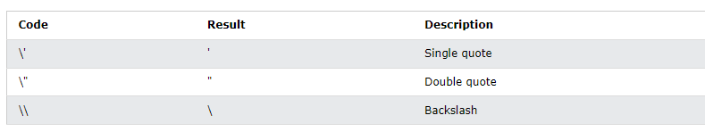

# JavaScript

# JavaScript Introduction

## JavaScript Can Change HTML Content

JavaScript Can Change HTML Content.One of many JavaScript HTML methods is getElementById().The example below "finds" an HTML element (with id="demo"), and changes the element content (innerHTML) to "Hello JavaScript".

```
<!DOCTYPE html>
<head>
    <title>Document</title>
    <script>
      function fun(){
        document.getElementById('demo').innerHTML="javascript can change html";
      }     
    </script>
</head>
<body>
    <p id="demo">what Can javaScript do?</p>
    <button type="button" onclick="fun()">click me</button>
    
</body>
</html>
```

## JavaScript Can Change HTML Styles (CSS)

Changing the style of an HTML element, is a variant of changing an HTML attribute.<br>
<b>Example:</b>

```
<!DOCTYPE html>
<head>
    <title>Document</title>
    <script>
      function fun(){
        document.getElementById('demo').style.fontSize="25px";
      }     
    </script>
</head>
<body>
    <h1>what Can javaScript do?</h1>
    <p id="demo">JavaScript can change the style of an HTML element.</p>
    <button type="button" onclick="fun()">click me</button>
    
</body>
</html>
```

## JavaScript Can Hide HTML Elements

Hiding HTML elements can be done by changing the display style.<br>

```
<!DOCTYPE html>
<head>
    <title>Document</title>
    <script>
      function fun(){
        document.getElementById('demo').style.display="none";
      }     
    </script>
</head>
<body>
    <p id="demo">JavaScript can hide HTML elements.</p>
    <button type="button" onclick="fun()">click me</button>
    
</body>
</html>
```

## JavaScript Can Show HTML Elements

Showing hidden HTML elements can also be done by changing the display style.<br>
<b>Example.</b>

```
<!DOCTYPE html>
<head>
    <title>Document</title>
    <script>
      function fun(){
        document.getElementById('demo').style.display="block";
      }     
    </script>
</head>
<body>
<h2>What Can JavaScript Do?</h2>
<p>JavaScript can show hidden HTML elements.</p>
<p id="demo" style="display:none">Hello JavaScript!</p>
 <button type="button" onclick="fun()">click me</button> 
</body>
</html>
```

## JavaScript Can Change HTML Attribute Values

In this example JavaScript changes the value of the src (source) attribute of an  tag.

```
<!DOCTYPE html>
<head>
    <title>Document</title>
    <script>
      function fun(){
        document.getElementById('demo').src='pic_bulboff.gif'
      }  
        function fun1(){
        document.getElementById('demo').src='pic_bulbon.gif';
      }     
    </script>
</head>
<body>
    <h2>What Can JavaScript Do?</h2>

    <p>JavaScript can change HTML attribute values.</p>
    <button type="button" onclick=fun1()>Turn on the light</button>
    
  <button type="button" onclick="fun()">Turn off the light</button> 
</body>
</html>
```

# internal javaScript

In this example, a JavaScript function is placed in the <head> or <body> section of an HTML page.<br>
The function is invoked (called) when a button is clicked:
<b>Examle</b>

```
<!DOCTYPE html>
<head>
    <title>Document</title>
    <script>
      function fun(){
        document.getElementById('demo').innerHTML="internal javaScript";
      }     
    </script>
</head>
<body>
    <p id="demo">what Can javaScript do?</p>
    <button type="button" onclick="fun()">click me</button>
    
</body>
</html>
```

# External javaScript

<b> External javascript file  (javascript file)</b>

```
function fun(){
    document.getElementById('demo').innerHTML="External javaScript";
  }    
```

<b>Html file</b>

```
<!DOCTYPE html>
<head>
    <title>Document</title>
    <script src="script.js"></script>
</head>
<body>
    <p id="demo">what Can javaScript do?</p>
    <button type="button" onclick="fun()">click me</button>
    
</body>
</html>
```

## External JavaScript Advantages

Placing scripts in external files has some advantages:

1. It separates HTML and code
2. It makes HTML and JavaScript easier to read and maintain
3. Cached JavaScript files can speed up page loads

# JavaScript Output
JavaScript can "display" data in different ways:<br>
1. Writing into an HTML element, using innerHTML.
2. Writing into the HTML output using document.write().
3. Writing into an alert box, using window.alert().
4. Writing into the browser console, using console.log().
## Using innerHTML
To access an HTML element, JavaScript can use the document.getElementById(id) method.<br>
The id attribute defines the HTML element. The innerHTML property defines the HTML content:<br>
```
<!DOCTYPE html>
<html>
  <body>
    <h1>Practice innerHTML</h1>

    <p id="demo"></p>

    <script>
      document.getElementById("demo").innerHTML = 5 + 6;
    </script>
  </body>
</html>
```

## Using document.write()
For testing purposes, it is convenient to use document.write():
```
<!DOCTYPE html>
<html>
  <body>
    <h1>Practice Document. write function</h1>

    <p id="demo"></p>

    <script>
      document.write (5 + 6);
    </script>
  </body>
</html>
```
## Using window.alert()
```
<html>
  <body>
    <h2>My First Web Page</h2>
    <p>My first paragraph.</p>

    <script>
      alert(5 + 6);
    </script>
  </body>
</html>
```

## JavaScript Print.
The only exception is that you can call the window.print() method in the browser to print the content of the current window.
```
<!DOCTYPE html>
<html>
  <body>
    <button onclick="window.print()">Print this page</button>
  </body>
</html>
```

# JavaScript Variables.
Variables are Containers for Storing Data.<br>
JavaScript Variables can be declared in 4 ways:
1. Automatically
2. Using var
3. Using let
4. Using const

# Function JavaScript
```
<!DOCTYPE html>
<head>
  <title>Document</title>
  
</head>
<body>
  <p id="demo"></p>
 <script>
    function rectangular_area(a,b){
      return a*b;
    }
    let x=rectangular_area(2,3);
    document.getElementById('demo').innerHTML=x;
  </script>
</body>
</html>
```

# Object create.

```
<!DOCTYPE html>
<head>
  <title>Document</title>
</head>
<body>
  <h2>JavaScript Object</h2>
  <p id='demo'></p>
  <script>
    //create an object
    const  Student={
      Name: "Masud",
      age: 18,
      Id:27
    };
    document.getElementById('demo').innerHTML="student Name = "+Student.Name+" Student age = "+Student.age;
       // another process
    document.getElementById('demo').innerHTML="student Name = "+Student["Name"]+" Student age = "+Student["age"];
  </script>
</body>
</html>
```

# Object Methods
```
<!DOCTYPE html>

<head>
  <title>Document</title>
</head>

<body>
  <h2>JavaScript Object</h2>
  <p id='demo'></p>
  <script>
    //create an object
    const person = {
      firstName: "Masud",
      lastName: "Ali",
      id: 27,
      fullName: function () {
        return this.firstName + " " + this.lastName;
      }
    };
    document.getElementById('demo').innerHTML = person.fullName();
  </script>
</body>
</html>
```
# JavaScript Events.
HTML events are "things" that happen to HTML elements.<br>
When JavaScript is used in HTML pages, JavaScript can "react" on these events.
Example.
```
<!DOCTYPE html>
<html>

<body>
  <h1>JavaScript HTML Events</h1>
  <h2>The onclick Attribute</h2>

  <button onclick="fun()">The time is?</button>
  <script>
    function fun() {
      document.getElementById('demo').innerHTML = Date();
    }
  </script>

  <p id="demo"></p>

</body>

</html>
```

In the next example, the code changes the content of its own element (using this.innerHTML):
```
<!DOCTYPE html>
<html>
<body>
<h1>JavaScript HTML Events</h1>
<h2>The onclick Attribute</h2>

<button onclick="this.innerHTML=Date()">The time is?</button>

</body>
</html>
```

# String
## String Length.
To find the length of a string, use the built-in length property.<br>
```
let text = "ABCDEFGHIJKLMNOPQRSTUVWXYZ";
let length = text.length;
```
## Escape Character
<br>
example: let text = "We are the so-called \"Vikings\" from the north.";<br>
output: We are the so-called "Vikings" from the north.

## JavaScript String Methods.
1. String length
2. String slice()
3. String substring()
4. String substr()
5. String replace()
6. String replaceAll()
7. String toUpperCase()
8. String toLowerCase()
9. String concat()
10. String trim()
11. String trimStart()
12. String trimEnd()
13. String padStart()
14. String padEnd()
15. String charAt()
16. String charCodeAt()
17. String split()

## Interpolation
Template literals provide an easy way to interpolate variables and expressions into strings.

The method is called string interpolation.
```
${...}
```

```
<!DOCTYPE html>
<html>
<body>
  <p id="demo"></p>
  <script>
    let firstName = "John";
    let lastName = "Doe";

    let text = `Welcome ${firstName}, ${lastName}!`;

    document.getElementById("demo").innerHTML = text;
  </script>

</body>
</html>
```
```
<!DOCTYPE html>
<html>
<body>
  <p id="demo"></p>
  <script>
    let price = 10;
    let VAT = 0.25;
    let total = `Total: ${(price * (1 + VAT)).toFixed(2)}`;

    document.getElementById("demo").innerHTML = total;
  </script>

</body>
</html>
```

<b>HTML template.</b>
```
<!DOCTYPE html>
<html>
<body>
  <p id="demo"></p>
  <script>
    let header = "Templates Literals";
    let tags = ["template literals", "javascript", "es6"];
    let html = `<h2>${header}</h2><ul>`;
    for (const x of tags) {
      html += `<li>${x}</li>`;
    }
    html += `</ul>`;
    document.getElementById("demo").innerHTML = html;
  </script>
</body>
</html>
```